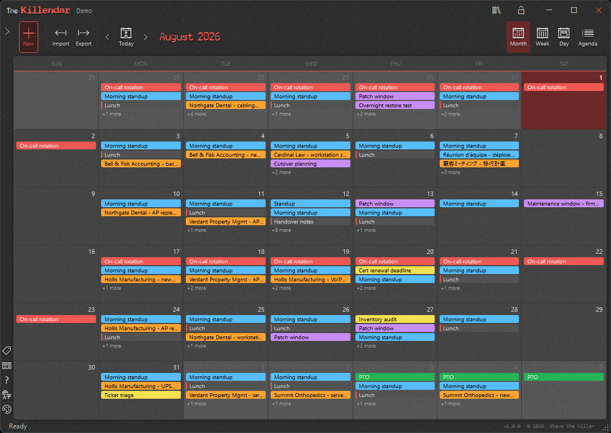
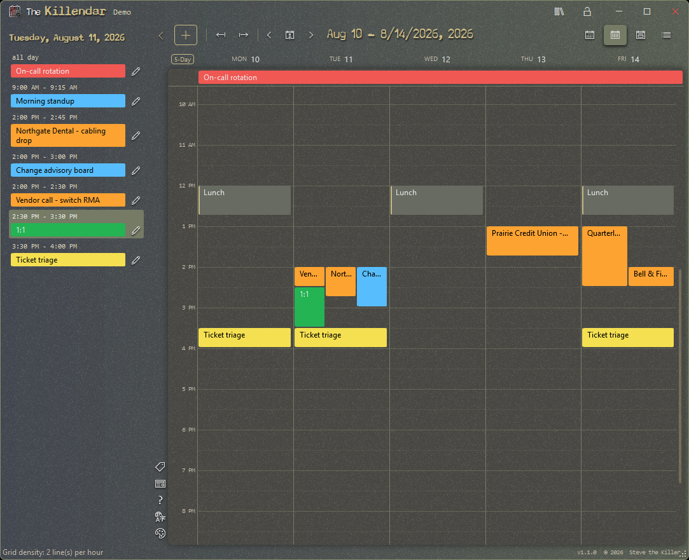
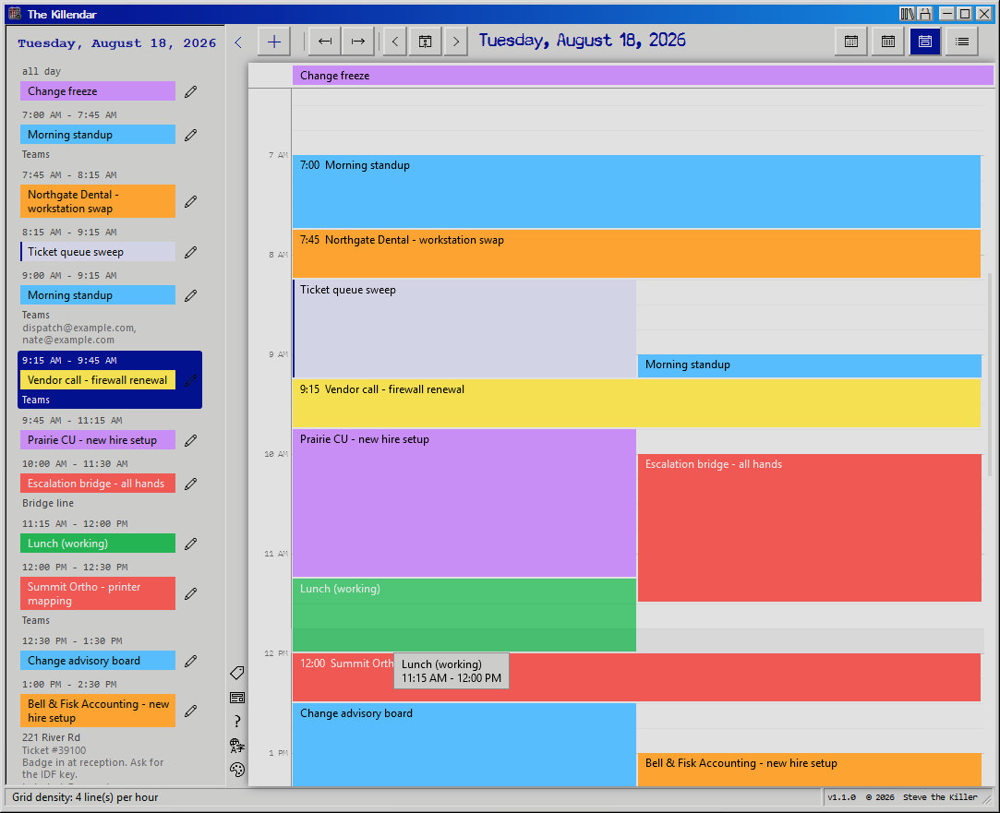
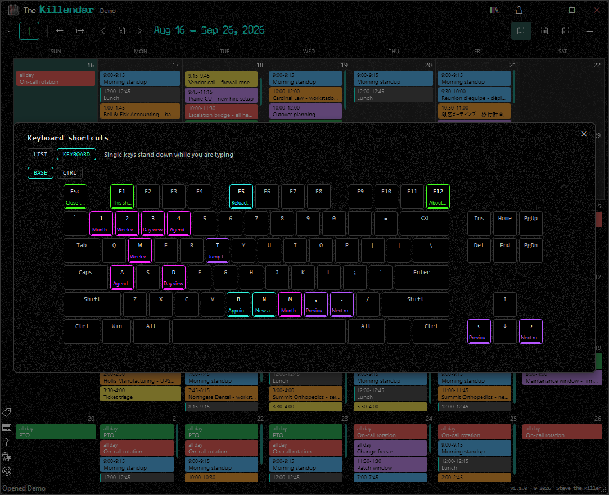

<p align="center">
  <a href="https://killendar.net"></a>
</p>

Free and open-source calendar for Windows with no account, no sync, and nothing phoning home. Month, week, day and agenda views, repeating appointments, color categories, iCalendar import and export, and optional AES-256 encryption at rest. Your appointments live in a single `.kcal` file on your own machine - an ordinary SQLite database until you put a password on it. Install or run portable. Single Windows EXE, ~3 MB, no runtime install required.

Internals, formats, storage details, and limits live on the [technical page](https://killendar.net/technical.html).

## Features

- Four views - month, week, day and agenda - with one shared previous / next / today control; Month zooms from one to six visible weeks and draws multi-day appointments as continuous runs
- Appointments edited in a slide-out sidebar panel, not a dialog: title, start and end, all-day, location, description and attendees
- Repeating appointments - daily, weekly on the days you tick, monthly or yearly, every N of those, ending never, after a count, or on a date - with per-date exceptions; editing or deleting one date asks whether you mean just that date or the whole series
- Drag to move appointments across times and days; overlapping appointments sit side by side instead of hiding one behind the other
- Color categories you define, painting every view; a 5-day work week toggle and a grid density control down to quarter hours
- Import and export in the formats people actually hand you: iCalendar (.ics, RFC 5545) both ways, CSV in Outlook's column format both ways, saved email invites (.eml) in, and a themed month-by-month web page out with a print stylesheet
- Optional encryption: the lock button puts a password on a Killendar and it is encrypted at rest with SQLCipher (AES-256, per-page HMAC-SHA512); opt-in, so no password means a plain readable SQLite file
- As many Killendars as you like - work, on-call, family - each its own `.kcal` file with its own password or none; keep them in the default profile folder, another folder you choose, or beside the portable executable
- Thirteen themes - Dark, Light, Black, 98SE, Blood, Greed, Cyanotic, Ectoplasm, Decay, Mourning, Sepulchre, Delirium and Malaise - four of them (Dark, Light, Black and 98SE) take six accent hues each, so 33 looks in all; fifteen languages switchable without a restart (contribute via `TRANSLATING.md`)
- Keyboard driven with single-key shortcuts; full keyboard shortcut overlay on F1 with list and visual keyboard views
- Runs portable, or self-installs per-user (no UAC) or machine-wide (`/silent` for scripted deployment); uninstalls cleanly and never deletes your appointments
- Verified code signing shown in the About card, checked with WinVerifyTrust rather than just read off the file
- Local-only: no account, no telemetry, no phone-home

## Screenshots

| | |
| --- | --- |
| <br>**Month view** - A full August of appointments, with all-day runs banded across the top of each day, on the Delirium theme. | <br>**Week view** - A five-day work week, overlapping appointments packed into lanes, on the Decay theme. |
| <br>**Day view** - One wall-to-wall day in the hour grid beside the day list, on the 98SE theme. | <br>**Shortcuts map** - The F1 overlay's keyboard view, every bound key lit and labeled, on the Black theme. |

## Requirements

- Windows 10 or 11 (x64)
- No runtime install. Everything needed is inside the EXE (targets .NET Framework 4.8, which ships with every supported Windows release).

## Download

WinGet:

```powershell
winget install killendar
```

- Prebuilt binary: <https://github.com/SteveTheKiller/Killendar/releases/latest/download/Killendar.exe>
- Source (GPL3 corresponding source for this release): <https://github.com/SteveTheKiller/Killendar/releases/download/v1.1.1/Killendar-1.1.1-src.zip>

## Build from source

```powershell
git clone https://github.com/SteveTheKiller/Killendar.git
cd Killendar
dotnet build Killendar.csproj -c Release
```

Requires the .NET Framework 4.8 developer pack and Visual Studio 2022 (or the Build Tools).

`brand/` holds the working artwork and is not tracked. Everything the app consumes is generated out of it into `Resources/`, which is tracked, so a fresh clone builds without it.

## Changelog

See [CHANGELOG.md](CHANGELOG.md).

## License

GPLv3. See [LICENSE](LICENSE). If you fork, modify, or redistribute Killendar, your version must also be released under GPLv3 with source available. No exceptions for commercial rebrands.
